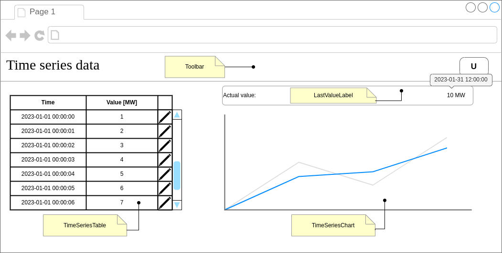

# Angular assignment

## Tasks
1) Create web application in Angular that shows time series data in various forms (chart, table). 
   Main application view should correspond to the following wireframe:
   

    * Use this git repository as the project base, see [quickstart](#quickstart).
    * For description of each component and its requirements, see [Components section](#components).
    * For [time series data](#time-series-data) use provided [DataService](./src/app/data.service.ts).

2) Restrict access to web application by creating initial login screen that provides name and password authentication. 
   Only authenticated users can gain access to the main application view. Allow user to logout via action button in the [toolbar](#toolbar).
    * Use [LoginService](./src/app/login.service.ts) to provide user authentication.

## Quickstart
This repository contains basic template for quickstart.

First fork this repository https://gitea.fuergy.tech/assignments/AngularAssignment1.git under your account.

Clone the forked repository:
> git clone https://gitea.fuergy.tech/<username>/AngularAssignment1.git

Go to created folder and install project dependencies:
> npm install

Serve project using:
> ng serve

Continue by implementing assigned [tasks](#tasks). Please ensure compliance with requirements of this assignment. Issues that are not stated in this assignment are subject to free interpretation.
Feel free to use any other libraries/frameworks that work with angular.

## Time series data
Various components must obtain time series data. All time series data are provided by [DataService](./src/app/data.service.ts).
Use following methods to obtain time series data:
- `DataService.stream()` - return the observable for time series data updates
- `DataService.getData()` - return last 30 minutes of data

All time series data are provided by [IData](./src/app/interface.ts) structure that contains: value time and it's numerical value.
Value time corresponds to unix timestamp in milliseconds. Values are numerical values in range from 0 (included) to 1000 (excluded).

## Components
Main application view contains multiple components. Following section describes each component requirements.

#### Toolbar
Top main view toolbar contains:
* application label (on the left side)
* dropdown button (on the right side) with user actions:
    - `logout` - provide user logout (redirects user back to the login screen)

#### LastValueLabel
This component shows last value from time series stream provided by [DataService.stream()](./src/app/data.service.ts).
On mouse hover, over time series value, tooltip with value time (in `YYYY-MM-DD hh.mm.ss` format) must be shown.

#### TimeSeriesTable
This component shows last 30 minutes of time series data in the form of table. Last 30 minutes of data can be retrieved by [DataService.getData()](./src/app/data.service.ts) and continuous updates can be retrieved by [DataService.stream()](./src/app/data.service.ts).
When new values occur, old values are discarded, so that only last 30 minutes of time series data are present.
Table contains three columns:
1. time - shows value timestamp in `YYYY-MM-DD hh.mm.ss` format
2. value - shows numeric value in format of two decimal places 
3. edit action button - this action allows user to edit value in table row

Requirements:
* Change of the value should be reflected in other components: [TimeSeriesChart component](#timeserieschart) and [LastValueLabel component](#LastValueLabel).
* Changed value need to be in range from 0 (included) to 1000 (excluded).
* Time series values in table are sorted by time in descending order (the newest values are on top of table).

#### TimeSeriesChart
This component shows last 30 minutes of time series data in form of line chart. Last 30 minutes of data can be retrieved by [DataService.getData()](./src/app/data.service.ts) and continuous updates can be retrieved by [DataService.stream()](./src/app/data.service.ts).
When new values occur, old values are discarded, so that only last 30 minutes of time series data are present.

Chart contains one line series (x-axis - values time, y-axis - values in format of two decimal places).
No other requirements for chart styles or chart objects (ticks, grid, tooltip, ...) are mandatory, but optionally can be present.

## Solution
After completing the assignment, please push your solution into your repository fork and send us notification.
